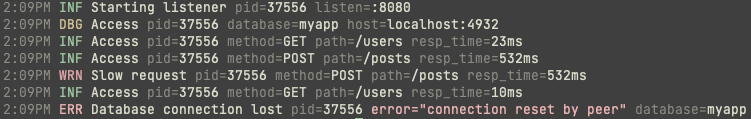

# Clog

Color logging with
[golang.org/x/exp/slog](https://pkg.go.dev/golang.org/x/exp/slog). Clog mimics
[`zerolog.ConsoleWriter`](https://github.com/rs/zerolog#readme) style but due to
the `slog.Handler` implementation field order is preserved, whereas the
`zerolog.ConsoleWriter` parses the json and sorts the field.

## Stability

Clog will track the `slog` package including any breaking changes.

